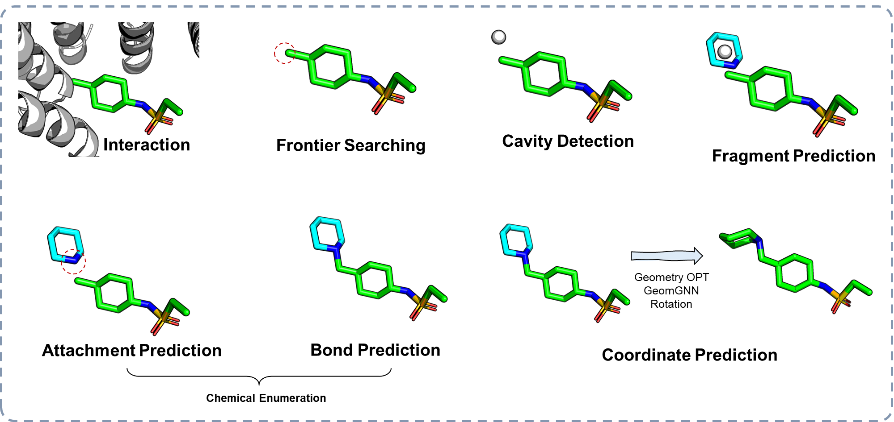

# :loudspeaker: Fragment wise 3D Structure-based Molecular Generation 

<div align=center>

</div>

## Environment

Install via conda .yml file (cuda 11.3)

```python
conda install mamba
mamba env create -f surfgen_environment.yml -n surfgen
conda activate surfgen 
```

If you're reluctant to use mamba: 

```python
conda env create -f surfgen_environment.yml -n surfgen
```

We also provide conda-packed file [here](https://doi.org/10.5281/zenodo.7758282). Download it and then unzip it in your conda/envs/dir. For me, the directory is ~/.conda/envs. Special thanks to the creators and organizers of zenodo, which provides a free platform to store large files for academic use. 

```shell
mkdir ~/.conda/envs/surfgen
tar -xzvf surfgen.tar.gz -C ~/.conda/envs/surfgen
conda activate surfgen
```

## Generation 

There are three versions of this model, one is the well-designed dihedral prediction version, one is GeomGNN version, and the other is GeomOPT version. 

#### To run the dihedral version: 

```python
python gen_from_pdb.py --config ./configs/sample_dihedral.yml --surf_file {surface_file} --pdb_file {pdb_file} --sdf_file {lig_file} --save_dir example --device cuda 
```

#### To run the GeomGNN version: 

```
python gen_from_pdb.py --config ./configs/sample_cartesian.yml --surf_file {surface_file} --pdb_file {pdb_file} --sdf_file {lig_file} --save_dir example --device cuda 
```

#### To run the GeomOPT version: 

```
python gen_from_pdb.py --config ./configs/sample_geomopt.yml --surf_file {surface_file} --pdb_file {pdb_file} --sdf_file {lig_file} --save_dir example --device cuda 
```

There are several examples in the `./example`. You can try them for a quick review. Furthermore, I have uploaded the [CrossDock test set](https://doi.org/10.5281/zenodo.10069394) (including original proteins, original files, and corresponding surface files). Puls, I also uploaded the [checkpoint](https://doi.org/10.5281/zenodo.11119040). for each version. 

#### Several parameters you can change according to your own needs. 

In yaml file, you can change several parameters for better exploration on chemical space, i.e., generate molecules with more diversity/more centric to some possible scaffolds. 

The sampling process is based on beam search way, and you can lower the threshold/next_threshold to make model focus on the "most probable" states. For queue_same_smi_tolorance, this is the allowance of the maximum number of same molecules in one sample_next run on a current item of the queue (only consider 2D structures, excluding 3D geometries). 

## Prepared Data

The main data used for training is CrossDock2020 

#### Download the data from the original source

```python
wget https://bits.csb.pitt.edu/files/crossdock2020/CrossDocked2020_v1.1.tgz -P data/crossdock2020/
tar -C data/crossdock2020/ -xzf data/crossdock2020/CrossDocked2020_v1.1.tgz
wget https://bits.csb.pitt.edu/files/it2_tt_0_lowrmsd_mols_train0_fixed.types -P data/crossdock2020/
wget https://bits.csb.pitt.edu/files/it2_tt_0_lowrmsd_mols_test0_fixed.types -P data/crossdock2020/
```

Then follow the guidelines to process it.  The train data split is [split_name.pt](https://drive.google.com/file/d/1WUZVNv--gztqDNoA3BEexXdjRfXKHuHn/view?usp=share_link). 

If it's inconvenient for you, we also provided the [processed data](https://doi.org/10.5281/zenodo.8421729). You just need to download them in ./data  and create a ./data/crossdock_pocket10 directory, and put the [index.pkl](https://drive.google.com/file/d/1-YCXOV-MWDOE-p6laQxOKPLPVJRakpL1/view?usp=share_link) in it.

## How to Process on your own data? 

#### Process the fragment data from the given molecule set. 

```python
python vocab_creator.py --all_mols ./crossdock_mols.pkl vocab_creator.py --frequence_threshold 30
```

You can process the fragments based on your own needs. Basically, you can prepare a fragment base in which fragments occur more than 30 times in your dataset, or you can select the top-k frequent fragments to control the size of fragment vocabulary. The explanation of arguments can be found in the `vocab_creator.py`. 

#### Process the protein-ligand pairs to the lmdb file for fast training. 

```
python train_data_process.py 
```

The detailed argument can be found in the `train_data_process.py`. You need to record your data in the index file first! I provide my preprocessed data and the raw materials in Zenodo! Hope you can benefit from it.   

### (Optional) Making surface data on your own. 

#### Create the base Python environment

##### Approach 1

Although we have prepared the required data for training and evaluation above. But you may want to apply SurfGen in your own case. So we provide the guidelines for creating the surf_maker environment.

```python
conda create -n surf_maker pymesh2 jupyter scipy joblib biopython rdkit plyfile -c conda-forge
```

We highly recommend using mamba instead of conda for speeding up. 

```python
mamba create -n surf_maker pymesh2 jupyter scipy joblib biopython rdkit plyfile -c conda-forge
```

##### Approach 2

We also provide the .yml file for creating environment

```
conda env create -f surf_maker_environment.yml
```

#### Install APBS Toolkits

When the base python environment was created, then install [APBS-3.0.0](https://github.com/Electrostatics/apbs/releases), [pdb2pqr-2.1.1](https://github.com/Electrostatics/apbs-pdb2pqr/releases) on your computer. Then set the msms_bin, apbs_bin, pdb2pqr_bin, and multivalue_bin path directly in your ~/.bashrc, or just set them in the scripts when creating the surface file from the pdb file.  

#### Try Generate Surface Now !

Now you have deployed all the dependent environments. Please follow the ./data/surf_maker for making surface data. Or run the ./data/surf_maker/surf_maker_test.py for testing whether you have figured out this environment successfully. 

```python
python ./data/surf_maker/surf_maker_test.py
# ply_file = osp.join(surf_path,index[i][1][:-4]+'_pocket_8.0_res_1.5.ply')

```

If the surface is generated, you will find the .ply file in the ./data/surf_maker

And we provide the generated surface file at ./data, namely 3cl_pocket_8.0_res_1.5.ply for further generation. 


## Training 

```python
python train.py
```


## Reference

If you find this work interesting, please cite

```
@article{zhang2024fraggen,
  title={FragGen: towards 3D geometry reliable fragment-based molecular generation},
  author={Zhang, Odin and Huang, Yufei and Cheng, Shichen and Yu, Mengyao and Zhang, Xujun and Lin, Haitao and Zeng, Yundian and Wang, Mingyang and Wu, Zhenxing and Zhao, Huifeng and others},
  journal={Chemical Science},
  year={2024},
  publisher={Royal Society of Chemistry}
}
```

